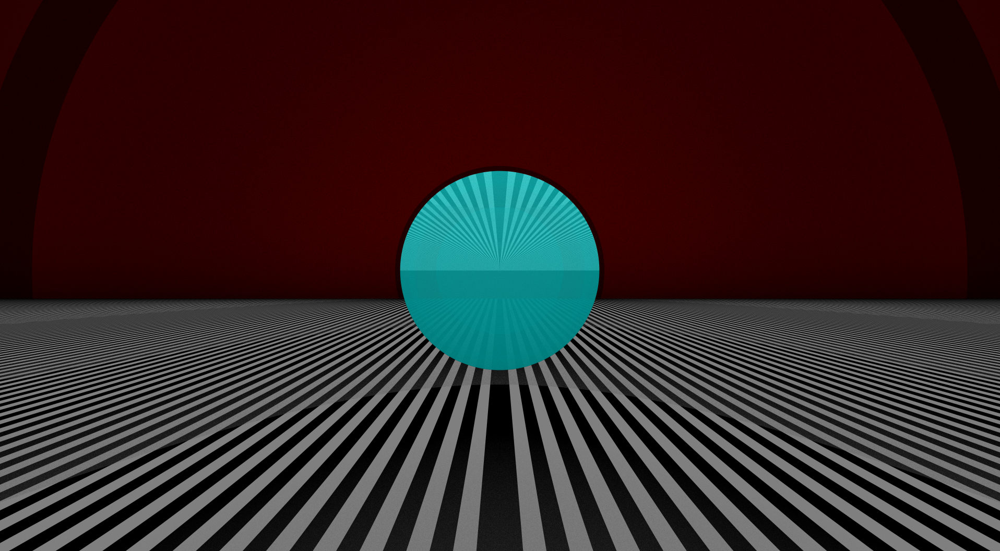

# Rayetracé

## Description

The Raytracer is a Tek2 project at Epitech.
The goal of this project is to create a raytracer in C++ using ray-casting.



## Features

- [x] Plugins (Loaded at runtime)
- [x] Basic shapes (Sphere, Plane, Cylinder, Cone)
- [x] Light sources (Point, Directional, Ambient)
- [x] Materials
- [x] Filters (Sepia, Black & White, Negative)
- [x] Multi-threading
- [x] Displays (SFML, PPM, TDL)

## How to use

### Compilation

```bash
mkdir ./build/ && cd ./build/
cmake .. -G "Unix Makefiles" -DCMAKE_BUILD_TYPE=Release
cmake --build .
```

### Execution

```bash
./raytracer [OPTIONS] [scene.cfg]
```

#### Exemple

```bash
./raytracer -d tdl config/simple2.cfg
```

### Options

- `-P` or `--plugin-path`: Set the plugin path (default: `./plugins`)
- `-D` or `--display-path`: Set the display path (default: `PPM`)
- `-d` or `--display-library`: Set the display (default: `PPM`)
- `-h` or `--help`: Display the help message
